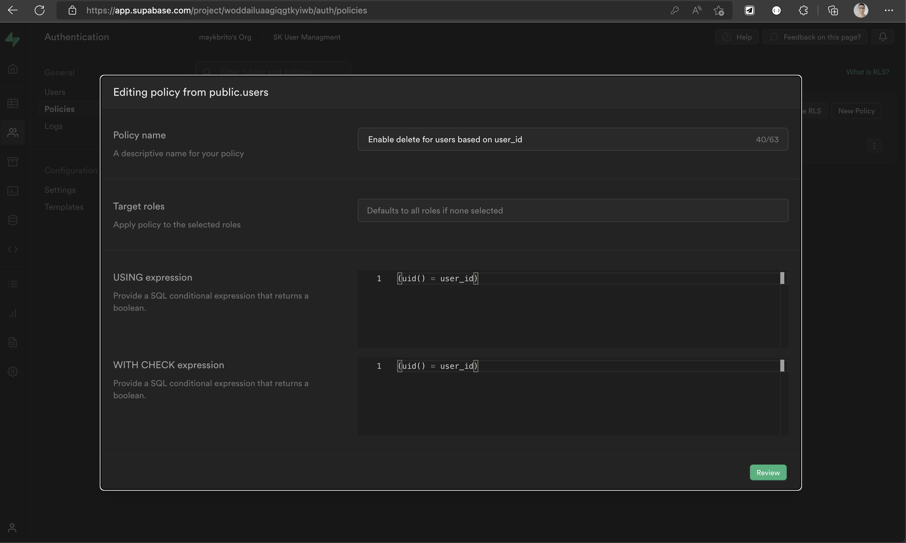

# CRD - Create Read Delete

User Admin

[Practicing Supabase Auth](https://www.youtube.com/watch?v=YqIyET7XKIQ)

--
## Supabase

- Create an account, a project and `.env` file with credentials.

- Create `users` table like this image

    

- Apply this RLS policy
    
    